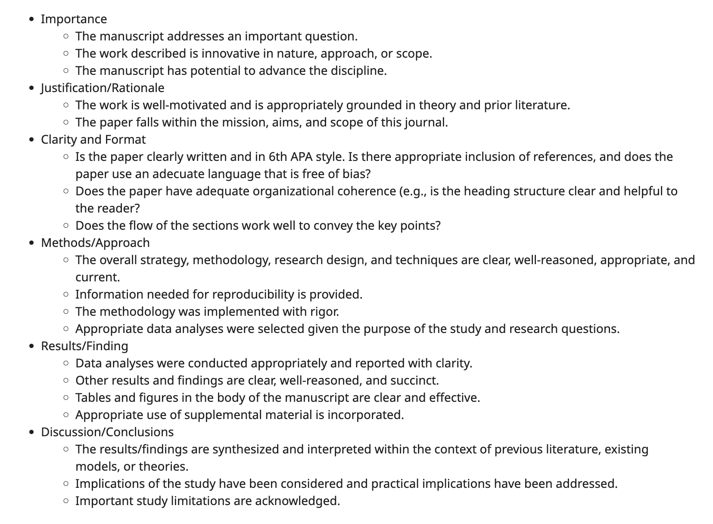

```{r setup, include=FALSE}
knitr::opts_chunk$set(echo = TRUE)
```

**Total marks: 20 marks**

Tasks:

1. Select a paper related to data science and artificial intelligence from https://arxiv.org/

2. Write a review report on the manuscript according to the "review criteria" at https://revistas.uma.es/index.php/ejfb/peer-review-process

A screenshot of the corresponding section is given below:




3. Comment on the writing style of each section of the paper (Introduction, Literature Review, Methodology, Data Analysis, Discussion, and Conclusions).

4. Use the Overleaf (https://www.overleaf.com/) to prepare your report. Share your overleaf project with me via ttalagala@sjp.ac.lk

Due date: 6 January 2023

Late submission: Submitting late work will be penalized by 1 mark per day.