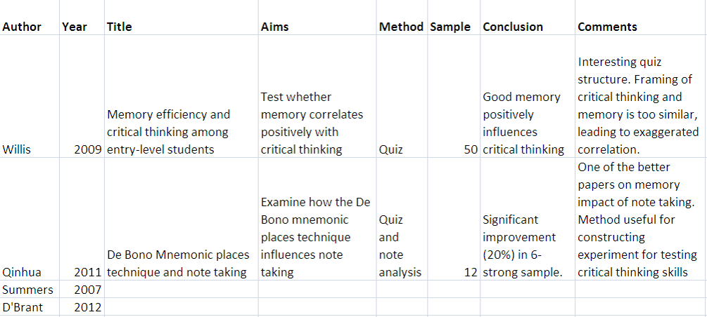

```{r xaringan-themer, include=FALSE, warning=FALSE}
library(xaringanthemer)
style_mono_accent(
  base_color = "#1c5253"
)
```

<style type="text/css">
.remark-slide-content {
    font-size: 30px;
}
</style>


```{css, echo = FALSE}
.remark-slide-content {
  font-size: 28px;
  padding: 20px 80px 20px 80px;
}
.remark-code, .remark-inline-code {
  background: #f0f0f0;
}
.remark-code {
  font-size: 24px;
}
.huge .remark-code { /*Change made here*/
  font-size: 200% !important;
}
.tiny .remark-code { /*Change made here*/
  font-size: 50% !important;
}
```

# Thesis Writing

.pull-left[

- **Physical space**


]

.pull-right[

```{r, comment=NA, echo=FALSE}
knitr::include_graphics("home.jpg")

```


]


---

# Thesis Writing

.pull-left[

- Physical space

- **Calendar space**

]

.pull-right[

```{r, comment=NA, echo=FALSE}
knitr::include_graphics("calendar.jpeg")

```


]

---

# Thesis Writing

.pull-left[

- Physical space

- Calendar space

- **Mental space**
]

.pull-right[

```{r, comment=NA, echo=FALSE}
knitr::include_graphics("mental.png")

```


]


---
# Focus

- Application

> Talagala, T. (2015). **Distributed lag nonlinear modelling approach to identify relationship between climatic factors and dengue incidence in Colombo District, Sri Lanka.** Epidemiology, Biostatistics and Public Health, 12(4).

- Methodological framework

> Montero-Manso, P., Athanasopoulos, G., Hyndman, R. J., & Talagala, T. S. (2020). **FFORMA: Feature-based forecast model averaging.** International Journal of Forecasting, 36(1), 86-92


---
# Focus (cont.)

- Development and application of a methodological framework 

> Talagala, Thiyanga S., Feng Li, and Yanfei Kang. **"FFORMPP: Feature-based forecast model performance prediction."** International Journal of Forecasting (2021).

---

# Types of Theses

1. Traditional thesis

2. Thesis by publication


---

# Types of Theses

1. Thesis by publication

2. **Traditional thesis**


---

# Thesis Structure

.pull-left[

- Abstract and Keywords

- Table of Contents

- List of Figures

- List of Tables

- List of Abbreviations

- Declaration

- Acknowledgements

]

.pull-right[

- Introduction

- Literature Review

- Methodology

- Results

- Discussion and Conclusions

- Bibliography or list of references

- Appendix
]


---
# Thesis Structure

.pull-left[

- **Abstract and Keywords**

- Table of Contents

- List of Figures

- List of Tables

- List of Abbreviations

- Declaration

- Acknowledgements

]

.pull-right[

- **Introduction**

- **Literature Review**

- **Methodology**

- **Results**

- **Discussion and Conclusions**

- Bibliography or list of references

- Appendix

]


---

# Abstract

**Do you want to make a good first impression?**

- A concise summary of the entire thesis

- First part that most people will read

- The last thing that you write


---
# Chapter 1: Introduction

1.1 Background of the study

1.2 Objectives of the study

1.3 Significance of the study

1.4 Thesis outline


---

# Chapter 1: Introduction

**1.1 Background of the study**

1.2 Objectives of the study

1.3 Significance of the study

1.4 Thesis outline


---
# 1.1 Background of the study

- Give an overview of your research topic

--

- Outline current methods/ brief review of current knowledge

--

- Motivation for your research: Evaluate current methods/ knowledge

- Show there is a need to be further research

--

- Introduce your research problem

--

- State research aims/ objectives

--

- Outline the order of the information in the chapter


---
class: inverse, middle, center


# Exercise 1

**Ballestra, L. V., Guizzardi, A., & Palladini, F. (2019). Forecasting and trading on the VIX futures market: A neural network approach based on open to close returns and coincident indicators. International Journal of Forecasting, 35(4), 1250-1262.**


---

#Ballestra, L. V., Guizzardi, A., & Palladini, F. (2019), IJF

"The VIX index represents the market’s estimate of the future volatility of the S&P 500 over the next thirty
days. It provide a benchmark of the short-term expected volatility, as futures and options contracts can be
inscribed on (see Whaley, 2008). In fact, implied volatility reflects the market makers’ point of view about the
expected volatility of the futures’ underlying assets. Therefore, since market makers are often among the most
informed agents, implied volatility should outperform the historical one in forecasting the realized volatility
of the futures’ underlying asset (Shu and Zhang, 2012)."

---

#Ballestra, L. V., Guizzardi, A., & Palladini, F. (2019), IJF

"**The VIX index represents the market’s estimate of the future volatility of the S&P 500 over the next thirty
days.** It provide a benchmark of the short-term expected volatility, as futures and options contracts can be
inscribed on (see Whaley, 2008). In fact, implied volatility reflects the market makers’ point of view about the
expected volatility of the futures’ underlying assets. Therefore, since market makers are often among the most
informed agents, implied volatility should outperform the historical one in forecasting the realized volatility
of the futures’ underlying asset (Shu and Zhang, 2012)."

> Give an overview of your research topic: **state the general topic - define terms**

---


#Ballestra, L. V., Guizzardi, A., & Palladini, F. (2019), IJF

"The VIX index represents the market’s estimate of the future volatility of the S&P 500 over the next thirty
days. **It provide a benchmark of the short-term expected volatility, as futures and options contracts can be
inscribed on (see Whaley, 2008).** In fact, implied volatility reflects the market makers’ point of view about the
expected volatility of the futures’ underlying assets. Therefore, since market makers are often among the most
informed agents, implied volatility should outperform the historical one in forecasting the realized volatility
of the futures’ underlying asset (Shu and Zhang, 2012)."

> Give an overview of your research topic: **Narrow down your topic**

---

#Ballestra, L. V., Guizzardi, A., & Palladini, F. (2019), IJF

"The VIX index represents the market’s estimate of the future volatility of the S&P 500 over the next thirty
days. It provide a benchmark of the short-term expected volatility, as futures and options contracts can be
inscribed on (see Whaley, 2008). **In fact,** implied volatility reflects the market makers’ point of view about the
expected volatility of the futures’ underlying assets. **Therefore,** since market makers are often among the most
informed agents, implied volatility should outperform the historical one in forecasting the realized volatility
of the futures’ underlying asset (Shu and Zhang, 2012).**"

> Give an overview of your research topic: **Ideas/ arguments are linked together.**

---
class: inverse, middle, center

# Exercise 1 (cont.): Paragraph 2

---

# Ballestra, L. V., Guizzardi, A., & Palladini, F. (2019), IJF

.tiny["Despite the importance and the common use of VIX as a volatility measure, only little attention has been paid
to the problem of forecasting it. In particular, the few works on the subject show that the VIX is to some extent
predictable. This finding, albeit theoretically interesting, is not necessarily helpful for traders, because VIX is
tradable only as derivative contracts, whose dynamics does not always follow that of the VIX index. For
example, Asensio (2013), Degiannakis (2008), Kostantinidi et al. (2008), Konstantinidi and Skiadopoulos
(2011), who are among the few authors focusing on VIX futures (henceforth referred to as VXFs), highlight
only a weak evidence of statistical predictability and experience a low level of profitability when implementing
trading strategies based on VIX forecasts. The overall picture is not encouraging for investors: on the one hand,
there is evidence that VIX is predictable; on the other, it seems very hard to trade VXFs by learning from the
(predicted) VIX dynamics. "]

---

# Ballestra, L. V., Guizzardi, A., & Palladini, F. (2019), IJF

.tiny["**Despite the importance and the common use of VIX as a volatility measure, only little attention has been paid
to the problem of forecasting it.** In particular, the few works on the subject show that the VIX is to some extent
predictable. This finding, albeit theoretically interesting, is not necessarily helpful for traders, because VIX is
tradable only as derivative contracts, whose dynamics does not always follow that of the VIX index. For
example, Asensio (2013), Degiannakis (2008), Kostantinidi et al. (2008), Konstantinidi and Skiadopoulos
(2011), who are among the few authors focusing on VIX futures (henceforth referred to as VXFs), highlight
only a weak evidence of statistical predictability and experience a low level of profitability when implementing
trading strategies based on VIX forecasts. The overall picture is not encouraging for investors: on the one hand,
there is evidence that VIX is predictable; on the other, it seems very hard to trade VXFs by learning from the
(predicted) VIX dynamics. "]

---

# Ballestra, L. V., Guizzardi, A., & Palladini, F. (2019), IJF

.tiny["Despite the importance and the common use of VIX as a volatility measure, only little attention has been paid
to the problem of forecasting it.** In particular, the few works on the subject show that the VIX is to some extent
predictable.** This finding, albeit theoretically interesting, is not necessarily helpful for traders, because VIX is
tradable only as derivative contracts, whose dynamics does not always follow that of the VIX index. For
example, Asensio (2013), Degiannakis (2008), Kostantinidi et al. (2008), Konstantinidi and Skiadopoulos
(2011), who are among the few authors focusing on VIX futures (henceforth referred to as VXFs), highlight
only a weak evidence of statistical predictability and experience a low level of profitability when implementing
trading strategies based on VIX forecasts. The overall picture is not encouraging for investors: on the one hand,
there is evidence that VIX is predictable; on the other, it seems very hard to trade VXFs by learning from the
(predicted) VIX dynamics. "]

---


# Ballestra, L. V., Guizzardi, A., & Palladini, F. (2019), IJF

.tiny["Despite the importance and the common use of VIX as a volatility measure, only little attention has been paid
to the problem of forecasting it. In particular, the few works on the subject show that the VIX is to some extent
predictable.** This finding, albeit theoretically interesting, is not necessarily helpful for traders, because VIX is **
tradable only as derivative contracts, whose dynamics does not always follow that of the VIX index. For
example, Asensio (2013), Degiannakis (2008), Kostantinidi et al. (2008), Konstantinidi and Skiadopoulos
(2011), who are among the few authors focusing on VIX futures (henceforth referred to as VXFs), highlight
only a weak evidence of statistical predictability and experience a low level of profitability when implementing
trading strategies based on VIX forecasts. The overall picture is not encouraging for investors: on the one hand,
there is evidence that VIX is predictable; on the other, it seems very hard to trade VXFs by learning from the
(predicted) VIX dynamics. "]

---

# Ballestra, L. V., Guizzardi, A., & Palladini, F. (2019), IJF

.tiny["Despite the importance and the common use of VIX as a volatility measure, only little attention has been paid
to the problem of forecasting it. In particular, the few works on the subject show that the VIX is to some extent
predictable. This finding, albeit theoretically interesting, is not necessarily helpful for traders, because VIX is 
tradable only as derivative contracts, whose dynamics does not always follow that of the VIX index.** For
example, Asensio (2013), Degiannakis (2008), Kostantinidi et al. (2008), Konstantinidi and Skiadopoulos
(2011), who are among the few authors focusing on VIX futures (henceforth referred to as VXFs), highlight
only a weak evidence of statistical predictability and experience a low level of profitability when implementing
trading strategies based on VIX forecasts.** The overall picture is not encouraging for investors: on the one hand,
there is evidence that VIX is predictable; on the other, it seems very hard to trade VXFs by learning from the
(predicted) VIX dynamics. "]

---

# Ballestra, L. V., Guizzardi, A., & Palladini, F. (2019), IJF

.tiny["Despite the importance and the common use of VIX as a volatility measure, only little attention has been paid
to the problem of forecasting it. In particular, the few works on the subject show that the VIX is to some extent
predictable. This finding, albeit theoretically interesting, is not necessarily helpful for traders, because VIX is 
tradable only as derivative contracts, whose dynamics does not always follow that of the VIX index.For
example, Asensio (2013), Degiannakis (2008), Kostantinidi et al. (2008), Konstantinidi and Skiadopoulos
(2011), who are among the few authors focusing on VIX futures (henceforth referred to as VXFs), highlight
only a weak evidence of statistical predictability and experience a low level of profitability when implementing
trading strategies based on VIX forecasts.** The overall picture is not encouraging for investors:** on the one hand,
there is evidence that VIX is predictable; on the other, it seems very hard to trade VXFs by learning from the
(predicted) VIX dynamics. "]

---
class: inverse, middle, center

# Exercise 1 (cont.): Paragraph 3

---

# Ballestra, L. V., Guizzardi, A., & Palladini, F. (2019), IJF

"In the present paper, in order to fill this “forecasting gap”, we present a new approach for modelling VXF
returns that provides a significant amount of predictability and allows us to build profitable trading strategies. "

---


# Ballestra, L. V., Guizzardi, A., & Palladini, F. (2019), IJF

"**In the present paper, in order to fill this “forecasting gap”, we present a new approach for modelling VXF
returns that provides a significant amount of predictability and allows us to build profitable trading strategies.**"

> Introduce the research problem

---

class: inverse, middle, center

# Exercise 2 


**Saha, M., Santara, A., Mitra, P., Chakraborty, A., & Nanjundiah, R. S. (2021). Prediction of the Indian summer monsoon using a stacked autoencoder and ensemble regression model. International Journal of Forecasting, 37(1), 58-71**

---

# Saha Moumita and others, 2021, IJF

"The Indian summer monsoon is a complex climatic
phenomenon. It refers to the rainfall occurring between
June and September, which contributes to more than
75% of the aggregate annual rainfall of the country. The
India Meteorological Department defines the monsoon
process as the seasonal reversal of the wind direction
down the shores of the Indian Ocean; blowing from the
southwest direction. "

---
# Saha Moumita and others, 2021, IJF

"**The Indian summer monsoon is a complex climatic
phenomenon.** It refers to the rainfall occurring between
June and September, which contributes to more than
75% of the aggregate annual rainfall of the country. The
India Meteorological Department defines the monsoon
process as the seasonal reversal of the wind direction
down the shores of the Indian Ocean; blowing from the
southwest direction." 


---
# Saha Moumita and others, 2021, IJF

.tiny["The Indian summer monsoon is a complex climatic
phenomenon.** It refers to the rainfall occurring between
June and September, which contributes to more than
75% of the aggregate annual rainfall of the country.** The
India Meteorological Department defines the monsoon
process as the seasonal reversal of the wind direction
down the shores of the Indian Ocean; blowing from the
southwest direction."]

---

# Saha Moumita and others, 2021, IJF

.tiny["The Indian summer monsoon is a complex climatic
phenomenon. It refers to the rainfall occurring between
June and September, which contributes to more than
75% of the aggregate annual rainfall of the country.** The
India Meteorological Department defines the monsoon
process as the** seasonal reversal of the wind direction
down the shores of the Indian Ocean; blowing from the
southwest direction."]


---

# Saha Moumita and others, 2021, IJF

.tiny["The Indian summer monsoon is a complex climatic
phenomenon. It refers to the rainfall occurring between
June and September, which contributes to more than
75% of the aggregate annual rainfall of the country. The
India Meteorological Department defines the monsoon
process as the seasonal reversal of the wind direction
down the shores of the Indian Ocean; blowing from the
southwest direction."]

...

.tiny["**The monsoon has a significant impact
on agriculture, growth of flora-fauna, hydro-electricity
production, freshwater renewal, and on the overall economic growth of the country.**"]

---

# Chapter 1: Introduction

1.1 Background of the study

**1.2 Objectives of the study**

1.3 Significance of the study

1.4 Thesis outline


---

#1.2 Objectives and aims of the study

**Aim:** what you hope to achieve.

**Objective:** the action(s) you will take in order to achieve the aim.

- The main research objective

- Specific aims of your research 


---

# Objectives should be SMART 

> **S**pecific 

> **M**easureable 

> **A**chievable

> **R**ealistic 

> **T**ime constrained 

---

# Example

**Comparison of Plant Species and Soil Traits at Sites Where Physaria ludoviciana
(Silvery Bladderpod) is Present or Absent in Three States**

.tiny[
"**The overall goal of this research is to understand biogeographical and
environmental factors that may explain why Physaria ludoviciana is present** in some sand
prairies but absent from the biological composition in others. For this project, areas
where P. ludoviciana is growing will be compared to nearby or parallel areas where it is
absent from the community structure in three different states (IL, MN, and NE). **The
specific objectives are to compare:**

a) Plant species composition, and

b) Soil traits (texture, calcium, magnesium, manganese, zinc, potassium, boron, copper,
iron, sodium, phosphorus, sulfur, cation exchange capacity, organic matter, buffer pH and
soil pH). "


]

source: https://www2.illinois.gov/dnr/grants/documents/wpfgrantreports/2008010w.pdf
---

# Chapter 1: Introduction

1.1 Background of the study

1.2 Objectives of the study

**1.3 Significance of the study**

1.4 Thesis outline

---

# 1.3 Significance of the study

- **Why** your research is needed

- **Who** benefits?

- **How** that specific audience will benefit from its findings

- **What** contribution will your study make to the literature or to the field? 

---

class: inverse, middle, centre

# Example


Konarasinghe, K. M. U. B. (2021). Forecasting COVID-19 Outbreak in the Philippines and Indonesia. Journal of New Frontiers in Healthcare and Biological Sciences, 2(1), 1-19.


---
# Forecasting COVID-19 Outbreak in the Philippines and Indonesia

.tiny["The results of this study could be a tool to be proactive and protect Indonesia and the
Philippines from the outbreak of the pandemic. **It could be useful to develop various
strategies and policies to control the spread of the pandemic.** The results of this study
would be **useful to work out the health care and medical resources with minimum waste.**
Base on the results the **authorities can decide the lockdown schedules and impose the
supply delivery systems** to attenuate the movement of the general public (Konarasinghe,
2020). The results of this study could be **another guide for business.** They can **decide how to improve their business functions** to gain maximum benefits and retain their external
stakeholders. "]


]

---

# Chapter 1: Introduction

1.1 Background of the study

1.2 Objectives of the study

1.3 Significance of the study

**1.4 Thesis outline**

---

# 1.4 Thesis outline

The remaining portion of this thesis is structured as follows: Chapter 2 provides a detailed
overview of the literature. Chapter 3 illustrates the methodology used by the thesis. .....


---
# Literature Review

To review the literature means to be able to identify:

- What has been established

- Areas of controversy 

- Emerging trends and new approaches

- Landmark papers/ Key references

---

# Literature review matrix



source: https://www.monash.edu/rlo/graduate-research-writing/write-the-thesis/introduction-literature-reviews

---
# Chapter 2: Literature Review

.pull-left[
- Introduction

    - Organisational pattern of the literature review

- Body paragraphs
  
    - Historical background
  
    - Methodologies
    
    - What contributions do they make to the field?
  
    ]

.pull-right[
- Body paragraphs (cont.)

    - The limitations of a study/the gaps in the study.
- Conclusions

    - The main agreement and disagreement
    
    - What you have drawn from reviewing the literature review?
    
    ]
    

---

# Literature review


- Chronological

- Thematic

- Methodological

---

# Chronological

According to when they were published 

- The development of the field over time

Talagala, T. S., Hyndman, R. J., & Athanasopoulos, G. (2018). Meta-learning how to forecast time series. Monash Econometrics and Business Statistics Working Papers, 6, 18.

---
background-image:url("litreview.png")
background-size: contain

---

# Thematic 

- Reviews of literature are organized around a topic or issue, rather than the progression of time.

- Different aspects of the topic


---

# Methodological

- Compare the results that emerge from using different methods


---

# Chapter 3: Methodology

- Research design

- Sources of Data

- Sampling design 

- Statistical software

- Data analysis/ Statistical methods


---

# Chapter 4: Results

- Reporting results is not enough

- Establish the connections between the patterns that emerge from your analysis and your research questions

- Relate those connections to the existing research, theory and knowledge


---

class: inverse, middle, center

# Data Visualization

---
# Cognitive Principles

**Less cognitive effort to read the chart (what is presented) and save the time to think about the content of the chart**

- Good visualizations take advantage of the human visual system's ability to process information with little effort. 

--

## Preattentive graph perception

It requires no conscious effort from the viewer to do understand what is presented through the design. It's automated and takes between 200-500 milliseconds to complete in the spatial memory.

--

(**Spatial** working **memory** entails the ability to keep spatial information active in working memory over a short period of time.)

---

# Preattentive visual properties

1. Color

2. Form: collinearity, curvature, marks, shape, size, spatial grouping, length, width, breadth

3. Spatial position: 2D, 3D

4. Movement: flicker, movement

```{r, comment=NA, echo=FALSE}
library(anicon)
anicon::faa("leaf")
anicon::faa("leaf", animate="bounce")
```


These are processed in our sensory memory without our conscious thoughts (without having knowledge of something).

---

class: inverse, center, middle

# Cognitive principles

---
# 1. Proximity

.pull-left[

```{r, comment=NA, echo=FALSE, message=FALSE, warning=FALSE}
library(palmerpenguins)
library(tidyverse)
data(penguins)
penguins[complete.cases(penguins),] %>%
  count(species, sex) %>%
  ggplot(aes(x=sex, y=n, fill=sex)) + 
  geom_bar(stat="identity") + 
  facet_grid(~species) +   scale_fill_manual(values = c("#FB7BBE","#6096FD"))

```
]

.pull-right[

```{r, comment=NA, echo=FALSE, message=FALSE, warning=FALSE}
library(palmerpenguins)
library(tidyverse)
data(penguins)
penguins[complete.cases(penguins),] %>%
  count(species, sex) %>%
  ggplot(aes(x=species, y=n, fill=species)) + 
  geom_bar(stat="identity") + 
  facet_grid(~sex) +   scale_fill_manual(values = c("darkorange","purple","cyan4"))

```

]

---

# 2. Similarity


.pull-left[

```{r, comment=NA, echo=FALSE, message=FALSE, warning=FALSE}
library(palmerpenguins)
library(tidyverse)
data(penguins)
penguins[complete.cases(penguins),] %>%
  count(species, sex) %>%
  ggplot(aes(x=sex, y=n, fill=sex)) + 
  geom_bar(stat="identity") + 
  facet_grid(~species) +   scale_fill_manual(values = c("#FB7BBE","#6096FD"))

```
]

.pull-right[

```{r, comment=NA, echo=FALSE, message=FALSE, warning=FALSE}
library(palmerpenguins)
library(tidyverse)
data(penguins)
penguins[complete.cases(penguins),] %>%
  count(species, sex) %>%
  ggplot(aes(x=species, y=n, fill=species)) + 
  geom_bar(stat="identity") + 
  facet_grid(~sex) +   scale_fill_manual(values = c("darkorange","purple","cyan4"))

```

]

---

# 3. Common region

.pull-left[
```{r, comment=NA, echo=F, warning=FALSE}
ggplot(penguins) + geom_point(aes(x=bill_length_mm, y=bill_depth_mm, color=species)) + scale_color_manual(values = c("darkorange","purple","cyan4"))

```

]

.pull-right[
```{r, comment=NA, echo=F, warning=FALSE}
ggplot(penguins) + geom_point(aes(x=bill_length_mm, y=bill_depth_mm, color=species)) + stat_ellipse(aes(x=bill_length_mm, y=bill_depth_mm, color=species, fill=species), geom="polygon", alpha=0.2)+ scale_color_manual(values = c("darkorange","purple","cyan4")) + 
  scale_fill_manual(values = c("darkorange","purple","cyan4")) 

```

]

---

# 4. Common fate

.pull-left[

```{r, warning=FALSE, comment=NA, message=FALSE, echo=FALSE}

library(coronavirus)
coronavirus %>% filter(country=="US" | country== "India") %>% filter(type=="confirmed") %>%  ggplot() + geom_line(aes(x=date, y=cases, color=country))

```


]

--
.pull-right[

```{r, warning=FALSE, comment=NA, message=FALSE, echo=FALSE}
US <- coronavirus %>% filter(country=="US" | country== "India") %>% filter(type=="confirmed") %>% group_by(country, date) %>%
  summarise(cases = sum(cases)) %>% filter(country=="US")
India <- coronavirus %>% filter(country=="US" | country== "India") %>% filter(type=="confirmed") %>% group_by(country, date) %>%
  summarise(cases = sum(cases)) %>% filter(country=="India")
df <- data.frame(India=India$cases, US=US$cases)
ggplot(df, aes(x=US, y=India)) + geom_point()

```


]

---

# Visualize same data under different angles

.pull-left[

US vs India

```{r, warning=FALSE, comment=NA, message=FALSE, echo=FALSE}

library(coronavirus)
coronavirus %>% filter(country=="US" | country== "India") %>% filter(type=="confirmed") %>%  ggplot() + geom_line(aes(x=date, y=cases, color=country))

```


]

.pull-right[

US vs Russia

```{r, warning=FALSE, comment=NA, message=FALSE, echo=FALSE}
coronavirus %>% filter(country=="US" | country== "Russia") %>% filter(type=="confirmed") %>%  ggplot() + geom_line(aes(x=date, y=cases, color=country))

```

]

---


.pull-left[

US vs India

```{r, warning=FALSE, comment=NA, message=FALSE, echo=FALSE}

US <- coronavirus %>% filter(country=="US" | country== "India") %>% filter(type=="confirmed") %>% group_by(country, date) %>%
  summarise(cases = sum(cases)) %>% filter(country=="US")
India <- coronavirus %>% filter(country=="US" | country== "India") %>% filter(type=="confirmed") %>% group_by(country, date) %>%
  summarise(cases = sum(cases)) %>% filter(country=="India")
df <- data.frame(India=India$cases, US=US$cases)
ggplot(df, aes(x=US, y=India)) + geom_point()


```


]

.pull-right[

US vs Russia

```{r, warning=FALSE, comment=NA, message=FALSE, echo=FALSE}
US<- coronavirus %>% filter(country=="US" | country== "India") %>% filter(type=="confirmed") %>% group_by(country, date) %>%
  summarise(cases = sum(cases)) %>% filter(country=="US")
Russia <- coronavirus %>% filter(country=="Russia" | country== "India") %>% filter(type=="confirmed") %>% group_by(country, date) %>%
  summarise(cases = sum(cases)) %>% filter(country=="Russia")
df <- data.frame(US=US$cases, Russia=Russia$cases)
ggplot(df, aes(x=US, y=Russia)) + geom_point()

```

]

---

# 5. Working memory

More than seven categories decrease readability and increase comprehension time. 

---
background-image:url("dataviz.png")
background-size: contain

# Working with Figures

Extracted from:

Wang, E., Cook, D., & Hyndman, R. J. (2020). Calendar-based graphics for visualizing people’s daily schedules. Journal of Computational and Graphical Statistics, 29(3), 490-502.

---
# Exercise

**US Adults Opinions on Climate Change Relevant Regulations**
.pull-left[

Q1. Require producing 20% of electricity from clean energy

Q2. Regulate $CO_2$ as a pollutant

Q3. Fund more research into renewable energy

Response: Strongly support (1), Somewhat support (2), Refused (3), Somewhat oppose (4), Strongly opposed (5) ]


.pull-right[


|   |  1 | 2  | 3  | 4  | 5  |
|-----|-----|-----|-----|-----|-----|
| Q1  |15   | 20  | 2  | 38  |  25 |
| Q2  | 10  | 14  | 2  |  44 |   30|
|  Q3 | 6  |  9 | 2  |  41 |  42|


]


---
background-image:url("table.png")
background-size: contain

# Tables: Talagala and others, FFORMPP, IJF, 2021

---


# Referring to Figures and Tables: present tense

*…results are presented in **T**able 5.1. **F**igure 2 shows…*


---

# Chapter 5: Discussion and Conclusions

**Discussion**

- Synthesis of ideas and main findings

- Significance of research findings

- Problems encountered

- Limitations

- Future directions of research

---

# Chapter 5: Discussion and Conclusions

**Conclusions**

- Final statement that sums up the thesis as a whole

- Reconnects to the introduction and main research problem

- A broad general conclusions emerging from the discussion


---
# Thesis Writing: Overleaf

Overleaf LaTeX editor: https://www.overleaf.com/

Source: https://www.overleaf.com/learn/latex/Learn_LaTeX_in_30_minutes

Mathematical expressions: https://www.overleaf.com/learn/latex/Mathematical_expressions

Greek letters: https://thiyanga.netlify.app/post/greekletters/


